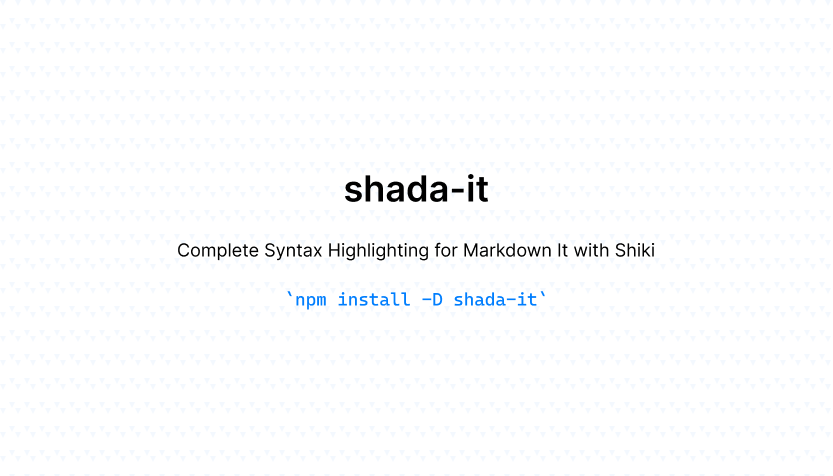

<p align="center">
  
</p>

# shada-it

Complete Syntax Highlighting for Markdown It with Shiki. Inspired by [markdown-it-shiki](https://github.com/antfu/markdown-it-shiki)

With `shada-it`, you can effortlessly manage your code blocks using simple comments with the `shada:{remove,add,focus}` syntax. It's compatible with various single-line comment styles, including:

- `#` for Ruby
- `<%#` for ERB Ruby
- `//` for JavaScript, TypeScript, and C++
- `/* */` for CSS

Demo: https://maful.web.id

## Install

```bash
npm i -D shada-it
```

## Usage

```js
import MarkdownIt from 'markdown-it'
import ShadaIt from 'shada-it'

const md = MarkdownIt()

md.use(ShadaIt, {
  theme: 'dracula'
})
```

Example:
~~~
```ts
interface AttrsLineOptions {
  lineNumber: boolean // shada:remove
  lineNumbers: boolean // shada:add
}
```
~~~


### Line numbers

By default, line numbers are hidden. To display them, simply include the `{lineNumbers:true}` option in your code block.

~~~
```ruby {lineNumbers:true}
class Post < ApplicationRecord
  validates :title, presence: true
  validates :body, presence: true
end
```
~~~


### Add lines

Adding lines to your code is a breeze with `shada:add`. Just use the appropriate comment syntax for your code block.

~~~
```ruby
class Post < ApplicationRecord
  has_one_attached :image # shada:add
end
```
~~~


### Remove lines

With `shada:remove`, you can easily indicate lines that should be removed from your code block using comments.

~~~
```ruby
class Post < ApplicationRecord
  has_one_attached :image # shada:remove
end
```
~~~


### Highlight lines

Make specific lines stand out by using `shada:highlight` with comment syntax tailored to your code block.

~~~
```ruby
class Post < ApplicationRecord
  has_one_attached :image # shada:highlight
end
```
~~~


### Focus lines

Need to draw attention to certain lines? Utilize `shada:focus` with the appropriate comment syntax for your code block.

~~~
```ruby
class Post < ApplicationRecord
  has_one_attached :image # shada:focus
end
```
~~~

Last, add these to your CSS

```css
pre code.has-focus-lines .line:not(.line-focus) {
  filter: blur(.095rem);
  opacity: .65;
  transition: filter .35s,opacity .35s
}

pre code.has-focus-lines:hover .line:not(.line-focus) {
  filter: blur();
  opacity: 1
}
```


## License

The gem is available as open source under the terms of the [MIT License](https://opensource.org/licenses/MIT).
